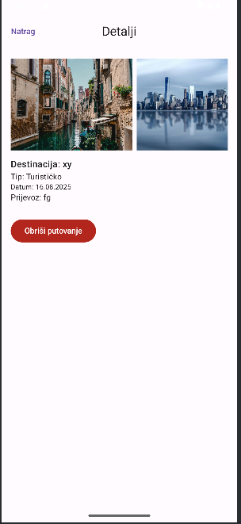
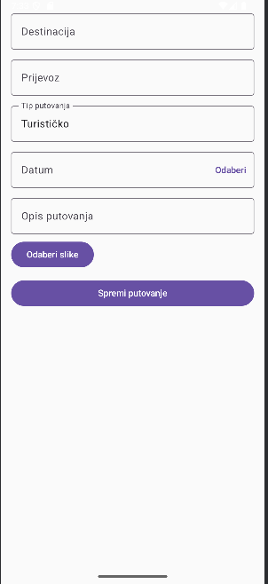
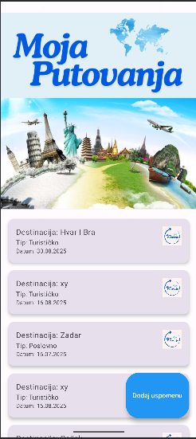

# Moja putovanja ✈️📸

Aplikacija za Android razvijena u Jetpack Compose i Kotlinu koja omogućuje korisnicima da bilježe i pregledavaju svoja putovanja.
Projekt razvijen u sklopu kolegija Razvoj mobilnih aplikacija.


## Funkcionalnosti
- Dodavanje novih putovanja s:
    - Destinacijom
    - Prijevozom
    - Tipom putovanja (poslovno, turistički...)
    - Datumom
    - Opisom putovanja (po želji)
    - Fotografije s putovanja
- Pregled svih spremljenih putovanja
- Detaljan prikaz odabranog putovanja
- Brisanje putovanja
- Personalizirani početni zaslon s logom aplikacije

## Tehnologije
- Kotlin
- Jetpack Compose
- Room (lokalna baza podataka)
- Coil (učitavanje slika)


## Screenshotovi
Početni zaslon:

Zaslon za dodavanje putovanja:

Zalon za pregled uspomena i informacija s putovanja:



## Pokretanje projekta
1. Kloniraj repozitorij:
   ```bash
   git clone https://github.com/LauraK276/Mobilna_aplikacija_2.git
2. Otvori u Android Studio
3. Pokreni na emulatoru ili fizičkom uređaju s Androidom
